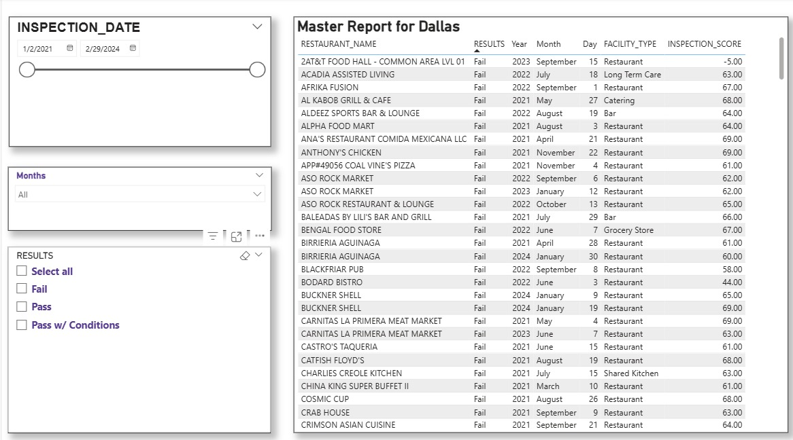
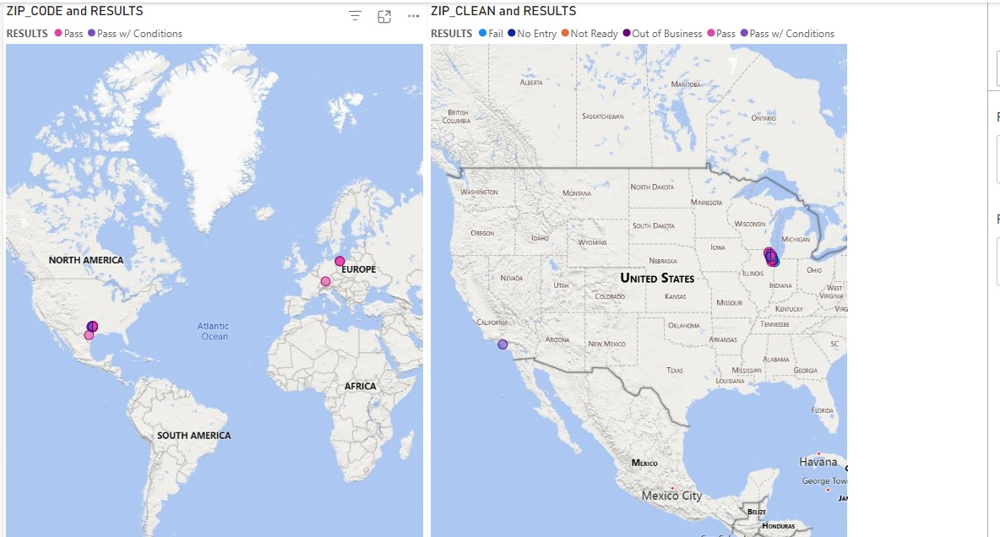
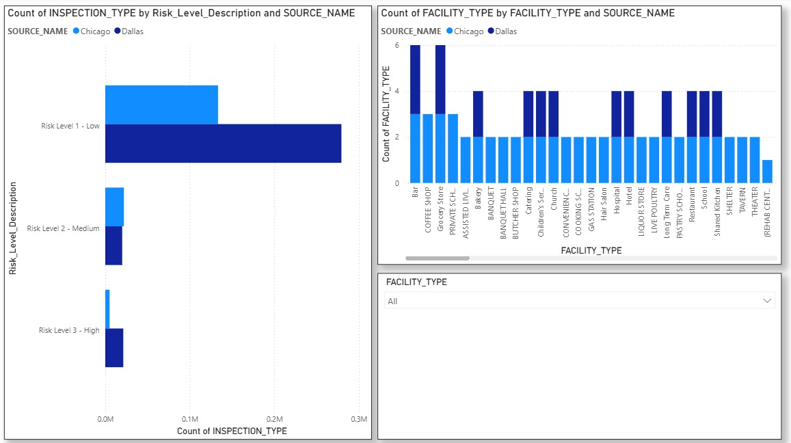
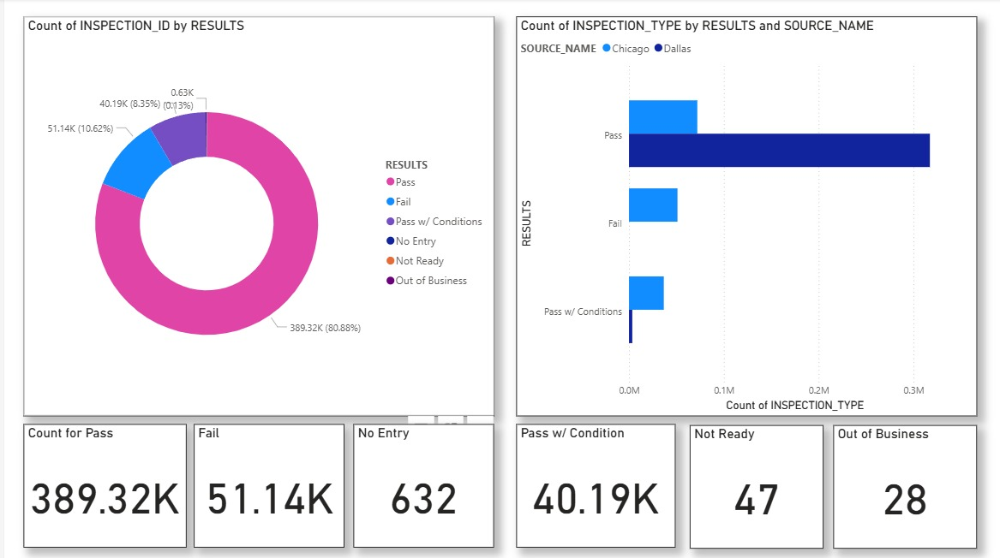
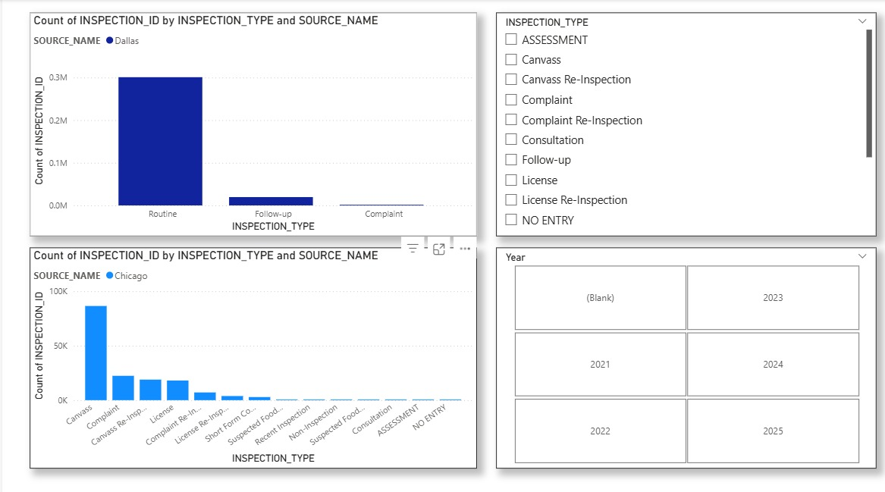
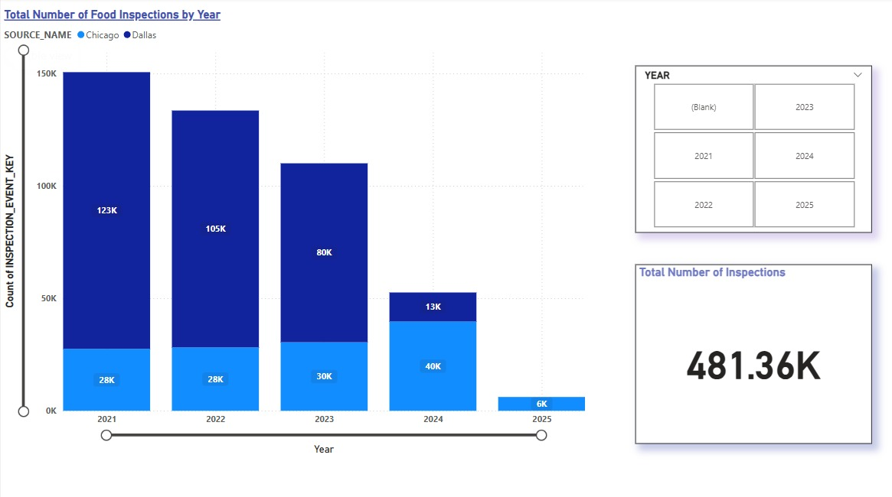
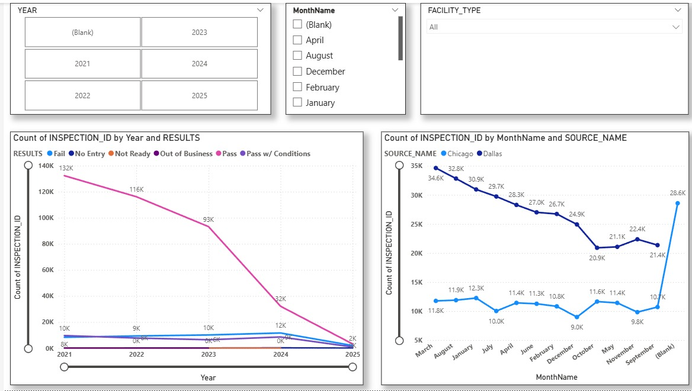

# Food Inspections Data Engineering & Business Intelligence

**Chicago & Dallas — Unified Public Health Analytics System**


## Project Overview

Food safety is a critical public health concern, yet inspection data across U.S. cities exists in wildly different formats, schemas, and semantic structures. This project builds a **unified, cross-city food inspection analytics platform** that enables meaningful comparison, trend analysis, and compliance monitoring across **Chicago** and **Dallas**.

The core challenge is **semantic incompatibility**: although both cities publish food inspection data, they use fundamentally different schemas, risk definitions, scoring mechanisms, and violation representations. Direct comparison without proper modeling leads to incorrect metrics, inflated counts, and misleading insights.

This project solves that by designing a **unified dimensional model** (1 fact table + 6 dimensions), integrating **10 source tables** through a common schema, and using **ADF Data Flow UPSERT (alter row)** to safely merge both cities' data — preventing accidental deletion, duplication, and data corruption — culminating in decision-ready **Power BI dashboards**.

---

## The Problem

| Challenge | Chicago | Dallas |
|---|---|---|
| **Source Tables** | 5 tables | 5 tables |
| **Schema Width** | Narrow (~17 columns) | Wide (~114 columns) |
| **Risk Representation** | Categorical labels (e.g., "Risk 1 - High") | Numeric inspection scores (0–100) |
| **Violation Format** | Free-text, pipe-delimited strings | Structured violation fields |
| **Data Orientation** | Reporting-oriented | Operational/compliance-oriented |
| **Inspection Types** | Canvass, Complaint, License, Re-Inspection, etc. | Routine, Follow-up, Complaint |
| **Result Categories** | Pass, Fail, Pass w/ Conditions, No Entry, Not Ready, Out of Business, Business Not Located | Pass, Fail |

**Why this matters:** Without proper normalization and a unified schema, combining these datasets leads to KPI inflation from row explosion, misleading risk comparisons across incompatible scales, duplicate counting, and incorrect trend analysis.

---

## Architecture

```
    ┌─────────────────────────────────────────────┐
    │          Raw City Data Sources               │
    │   Chicago: 5 source tables (~17 cols each)   │
    │   Dallas:  5 source tables (~114 cols each)  │
    └──────────────────┬──────────────────────────┘
                       │
                       ▼
    ┌─────────────────────────────────────────────┐
    │         Data Profiling & EDA                 │
    │         (ydata-profiling / Jupyter)           │
    └──────────────────┬──────────────────────────┘
                       │
                       ▼
    ┌─────────────────────────────────────────────┐
    │      City-Specific Data Cleaning             │
    │      (Alteryx Workflows)                     │
    │      • Chicago_Altryex.yxmd                  │
    │      • Dallas_Cleaning.yxmd                  │
    │      • Regression-based deduplication         │
    └──────────────────┬──────────────────────────┘
                       │
                       ▼
    ┌─────────────────────────────────────────────────────┐
    │            Azure Data Factory (ADF)                  │
    │                                                      │
    │  Linked Services → Datasets → Data Flows → Pipelines │
    │                                                      │
    │  Schema Integration Strategy:                        │
    │  ┌─────────────┐      ┌─────────────┐               │
    │  │  Chicago     │      │   Dallas     │               │
    │  │  (5 tables)  │      │  (5 tables)  │               │
    │  └──────┬──────┘      └──────┬──────┘               │
    │         │                     │                       │
    │         ▼                     ▼                       │
    │  ┌─────────────┐      ┌─────────────┐               │
    │  │ LOAD FIRST  │      │   UPSERT    │               │
    │  │ (Initial    │ ───▶ │ (Alter Row  │               │
    │  │  Insert)    │      │  Transform) │               │
    │  └─────────────┘      └─────────────┘               │
    │         │                     │                       │
    │         └────────┬────────────┘                       │
    │                  ▼                                    │
    │         Common Unified Schema                        │
    │         (No duplicates, no accidental deletes)       │
    └──────────────────┬──────────────────────────────────┘
                       │
                       ▼
    ┌─────────────────────────────────────────────┐
    │         Snowflake Data Warehouse             │
    │    Staging → Star Schema (1 Fact + 6 Dims)   │
    │                                              │
    │    FCT_Food_Inspection                       │
    │    DIM_Business  │ DIM_Facility              │
    │    DIM_Location  │ DIM_Date                  │
    │    DIM_Risk      │ DIM_Violation             │
    └──────────────────┬──────────────────────────┘
                       │
                       ▼
    ┌─────────────────────────────────────────────┐
    │    Business-Requirement-Driven SQL (BR1–BR7) │
    └──────────────────┬──────────────────────────┘
                       │
                       ▼
    ┌─────────────────────────────────────────────┐
    │          Power BI Dashboards                 │
    │    (8 report pages, KPIs, maps, trends)      │
    └─────────────────────────────────────────────┘
```

---

## Tools & Technologies

| Layer | Tool | Purpose |
|---|---|---|
| Data Profiling | ydata-profiling, Jupyter Notebooks | Statistical profiling, data quality assessment, EDA |
| Data Cleaning | Alteryx | City-specific cleaning workflows, regression-based deduplication, schema normalization |
| Data Integration & Orchestration | **Azure Data Factory** | Pipelines, data flows (with alter row UPSERT), linked services, datasets — full ETL orchestration |
| Data Warehouse | Snowflake | Staging tables → dimensional star schema |
| Data Modeling | ER/Studio Data Architect | Logical dimensional model design (star schema with SCD types) |
| Analytics | SQL | Business-requirement-driven queries (7 BRs) |
| Visualization | **Power BI** | Interactive dashboards with KPIs, geographic maps, trend analysis, cross-city comparisons |

---

## Data Sources

**Chicago Food Inspections (5 source tables)** — Narrow, reporting-oriented dataset (~17 columns per table). Risk expressed as categorical labels (Risk Level 1–3). Violations stored as free-text, pipe-delimited strings. Primary inspection types include Canvass, Complaint, Canvass Re-Inspection, License, and 10+ others. Result categories: Pass, Fail, Pass w/ Conditions, No Entry, Not Ready, Out of Business, Business Not Located.

**Dallas Food Inspections (5 source tables)** — Wide, operational dataset (~114 columns per table). Risk inferred from numeric inspection scores (0–100). Structured violation descriptions. Primary inspection types: Routine, Follow-up, Complaint. Result categories: Pass, Fail.

---

## Schema Integration Strategy (UPSERT)

A critical engineering decision in this project was the **schema integration approach** for merging 10 source tables from 2 completely different schemas into a single unified model.

**The approach:**

1. **Designed a common unified schema** that accommodates attributes from both cities while preserving semantic meaning
2. **Loaded Chicago first** as the initial insert — Chicago's 5 source tables were cleaned via Alteryx, profiled, and loaded into the common schema as the baseline dataset
3. **UPSERT'd Dallas using ADF Data Flows (Alter Row transformation)** — Dallas's 5 source tables were mapped to the same common schema and merged using UPSERT logic, which:
   - **Inserts** new Dallas records that don't exist in the target
   - **Updates** matching records if Dallas has newer or corrected data
   - **Never deletes** existing Chicago data — preventing accidental data loss
4. **Regression-based deduplication** was applied during cleaning to match and deduplicate records across sources, ensuring no duplicate inspections inflate KPIs

This UPSERT strategy ensures **data integrity across both cities** — no wrong data, no accidental deletions, and no duplication — while maintaining a single, clean, queryable schema.

---

## Dimensional Model

Designed in **ER/Studio Data Architect** with 7 entities, 37 attributes, and 6 relationships.

### Fact Table: `FCT_Food_Inspection`

**Grain:** One row per inspection event

| Column | Type | Description |
|---|---|---|
| Inspection_Event_Key | INTEGER (PK) | Surrogate key |
| Facility_Key | INTEGER (FK) | → DIM_Facility |
| Business_Key | INTEGER (FK) | → DIM_Business |
| Location_Key | INTEGER (FK) | → DIM_Location |
| Violation_Key | INTEGER (FK) | → DIM_Violation |
| Date_Key | INTEGER (FK) | → DIM_Date |
| Risk_Key | INTEGER (FK) | → DIM_Risk |
| DI_JOB_ID | INTEGER | Data integration job identifier |
| DI_Create_DT | DATE | ETL audit timestamp |
| Inspection_Type | VARCHAR(100) | Type of inspection performed |
| Result | VARCHAR(50) | Pass, Fail, Pass w/ Conditions, etc. |
| Inspection_ID | INTEGER | Source system inspection identifier |
| Source_Name | VARCHAR(50) | Chicago or Dallas |

### Dimension Tables

| Dimension | SCD Type | Key Attributes |
|---|---|---|
| `DIM_Business` | Type 1 (overwrite) | Business_Key, DBA_Name, AKA_Name, License |
| `DIM_Facility` | Type 0 (fixed) | Facility_Key, Facility_Type |
| `DIM_Risk` | Type 0 (fixed) | Risk_Key, Risk_Level, Inspection_Score |
| `DIM_Location` | Type 1 (overwrite) | Location_Key, Latitude_Longitude, Longitude, Latitude, City, Address, Zip_Code, State |
| `DIM_Date` | Fixed | Date_Key, Inspection_Date, Year, Month, Weekday |
| `DIM_Violation` | Type 2 (history) | Violation_Key, Violation_Description |

**Why these SCD types matter:**
- **Type 0 (Facility, Risk):** These attributes don't change — a restaurant is always a restaurant, risk categories are static definitions
- **Type 1 (Business, Location):** Businesses can rename or relocate; we want the current state, not historical versions
- **Type 2 (Violation):** Violation definitions can change over time (Chicago changed violation codes in 2018); tracking history preserves analytical integrity
- **Fixed (Date):** Calendar attributes never change

---

## Power BI Dashboards

The Power BI report contains **8 interactive pages** with slicers for inspection date range, months, year, inspection type, facility type, and result filtering.

### Page 1 — Master Report: Dallas
Restaurant-level detail table with inspection scores (0–100), facility types (Restaurant, Bar, Grocery Store, Long Term Care, Shared Kitchen, Catering), and Pass/Fail results. Filterable by date range (1/2/2021 – 2/29/2024) and result status.

### Page 2 — Master Report: Chicago
DBA-level detail table with results, addresses, and inspection types. Filterable by date range (1/4/2021 – 3/5/2025) and expanded result categories (Business Not Located, Fail, No Entry, Not Ready, Out of Business, Pass, Pass w/ Conditions).

### Page 3 — Geographic Analysis
Dual map visualization — **ZIP_CODE scatter map** showing Pass/Pass w/ Conditions distribution globally, and **ZIP_CLEAN choropleth** showing all result types across the US. Validates data quality by identifying geographic outliers (e.g., records mapping to Europe indicating bad zip codes).

### Page 4 — Risk & Facility Analysis
**Horizontal bar chart** — Inspection counts by Risk Level (Low/Medium/High) split by Chicago vs Dallas. Risk Level 1 (Low) dominates both cities (~300K for Dallas, ~50K for Chicago). **Grouped bar chart** — Facility type distribution across both cities covering 25+ facility types.

### Page 5 — Inspection Results Overview
**Donut chart** — Overall result distribution: Pass 389.32K (80.88%), Fail 51.14K (10.62%), Pass w/ Conditions 40.19K (8.35%), No Entry 632 (0.13%), Not Ready 47, Out of Business 28. **KPI cards** for each result category. **Stacked bar chart** comparing results by source city — Dallas dominates Pass counts, Chicago has higher proportional Fail and Pass w/ Conditions.

### Page 6 — Inspection Type Breakdown
**Dallas:** Dominated by Routine inspections (~280K), with small volumes for Follow-up and Complaint. **Chicago:** More distributed — Canvass (~90K), Complaint, Canvass Re-Inspection, License, Complaint Re-Inspection, License Re-Inspection, Short Form Complaint, Suspected Food Poisoning, Recent Inspection, Non-Inspection, Consultation, Assessment, No Entry. Year slicer (2021–2025).

### Page 7 — Yearly Trends
**Stacked bar chart** — Total inspections by year, split by source city. Declining trend from ~151K (2021: 123K Dallas + 28K Chicago) → ~133K (2022) → ~110K (2023) → ~53K (2024) → ~6K (2025, partial year). **Total inspections: 481.36K.** Year slicer for dynamic filtering.

### Page 8 — Time Series Analysis
**Line chart** — Results by year: Pass declining from 132K (2021) to 32K (2024); Fail steady at ~10K annually. **Monthly trend by source** — Chicago peaks in March (11.9K) and August (12.3K); Dallas peaks in March (34.6K) and September (28.6K). Dallas shows a gradual decline through the year while Chicago remains relatively stable.

### Dashboard Screenshots

<p align="center">
  
  
</p>
<p align="center">
  
  
</p>
<p align="center">
  
  
</p>
<p align="center">
  
  
</p>

---

## Business Requirements & SQL Analytics

### BR1 – Inspection Results by Type
> How do inspection results vary by inspection type?
```sql
SELECT Inspection_Type, Result, COUNT(*) AS Total_Inspections
FROM FCT_Food_Inspection
GROUP BY Inspection_Type, Result
ORDER BY Total_Inspections DESC;
```

### BR2 – Monthly / Weekly Inspection Trends
> What are the monthly, weekly, and weekday trends in inspections?
```sql
SELECT d.Year, d.Month, d.Weekday, COUNT(*) AS Total_Inspections
FROM FCT_Food_Inspection f
JOIN DIM_Date d ON f.Date_Key = d.Date_Key
GROUP BY d.Year, d.Month, d.Weekday
ORDER BY d.Year, d.Month;
```

### BR3 – Risk Level and Scores
> How do risk levels and inspection scores compare across cities?
```sql
SELECT r.Risk_Level, COUNT(*) AS Total_Inspections, AVG(r.Inspection_Score) AS Avg_Score
FROM FCT_Food_Inspection f
JOIN DIM_Risk r ON f.Risk_Key = r.Risk_Key
GROUP BY r.Risk_Level
ORDER BY Avg_Score ASC;
```

### BR4 – Top Violations
> What are the most common violations?
```sql
SELECT v.Violation_Description, COUNT(*) AS Violation_Count
FROM FCT_Food_Inspection f
JOIN DIM_Violation v ON f.Violation_Key = v.Violation_Key
GROUP BY v.Violation_Description
ORDER BY Violation_Count DESC
LIMIT 10;
```

### BR5 – Repeat Offender Businesses
> Which businesses are repeat offenders?
```sql
SELECT b.DBA_Name, b.AKA_Name, b.License, COUNT(*) AS Failed_Inspections
FROM FCT_Food_Inspection f
JOIN DIM_Business b ON f.Business_Key = b.Business_Key
WHERE f.Result IN ('Fail', 'Out of Business')
GROUP BY b.DBA_Name, b.AKA_Name, b.License
HAVING COUNT(*) > 1
ORDER BY Failed_Inspections DESC;
```

### BR6 – Facility Type Comparison
> How do facility types perform in terms of failures?
```sql
SELECT fac.Facility_Type, COUNT(*) AS Total_Inspections,
       SUM(CASE WHEN f.Result = 'Fail' THEN 1 ELSE 0 END) AS Failures
FROM FCT_Food_Inspection f
JOIN DIM_Facility fac ON f.Facility_Key = fac.Facility_Key
GROUP BY fac.Facility_Type
ORDER BY Failures DESC;
```

### BR7 – Location-Based Insights
> What geographic patterns exist in inspection activity?
```sql
SELECT loc.City, loc.State, loc.Zip_Code, COUNT(*) AS Total_Inspections
FROM FCT_Food_Inspection f
JOIN DIM_Location loc ON f.Location_Key = loc.Location_Key
GROUP BY loc.City, loc.State, loc.Zip_Code
ORDER BY Total_Inspections DESC;
```

---

## Key Design Decisions

**1. ADF Data Flow UPSERT for Schema Integration** — Rather than truncate-and-reload or separate fact tables per city, we used ADF's Alter Row transformation to UPSERT Dallas data into the Chicago-loaded baseline. This prevents accidental deletion of existing records, handles duplicates gracefully, and maintains a single unified schema. This was the foundational decision enabling cross-city analytics.

**2. Regression-Based Deduplication** — Applied during the cleaning phase to identify and match duplicate records across sources. This ensures inspection counts remain accurate and KPIs aren't inflated by duplicate entries across the 10 source tables.

**3. Star Schema with SCD Types** — Dimensional modeling with intentional SCD type assignments: Type 0 for stable attributes (facility, risk), Type 1 for current-state attributes (business, location), Type 2 for historically tracked attributes (violations), and Fixed for calendar dimensions. This ensures both analytical correctness and query performance.

**4. City-Aware ETL Instead of Single Pipeline** — Separate Alteryx workflows for Chicago and Dallas because risk and violation semantics differ fundamentally. More ETL logic, but no loss of semantic meaning, enabling successful unification into a common schema.

**5. Risk Normalization via Unified DIM_Risk** — Chicago uses categorical risk (Level 1/2/3); Dallas uses numeric scores (0–100). A unified dimension with both Risk_Level and Inspection_Score enables cross-city risk comparison without conflating different measurement systems.

**6. Source Tracking on Fact Table** — The `Source_Name` column on FCT_Food_Inspection preserves data lineage, enabling city-specific filtering and cross-city comparison in every dashboard and query.

---

## Key Outcomes

- Unified **10 source tables** (5 Chicago + 5 Dallas) across **2 incompatible schemas** into one analytical star schema processing **481K+ inspection records**
- Implemented **ADF Data Flow UPSERT** (alter row) to safely integrate both cities without data loss, accidental deletion, or duplication
- Applied **regression-based deduplication** during ETL to ensure KPI accuracy across all 10 source tables
- Designed dimensional model in **ER/Studio** with 7 entities, 37 attributes, 6 relationships, and intentional SCD type assignments
- Delivered **8 interactive Power BI dashboard pages** with cross-city comparisons, geographic analysis, risk normalization, and time-series trends
- Demonstrated end-to-end data engineering across profiling (ydata), cleaning (Alteryx), orchestration (ADF), warehousing (Snowflake), modeling (ER/Studio), and visualization (Power BI)

---

## Contributors

- [Aksh Talati](https://github.com/akshtalati)
- [Bhargav Gandhi](https://github.com/gandhi-bh)

---

*Final Project — DADABI Spring 2025, Northeastern University*
